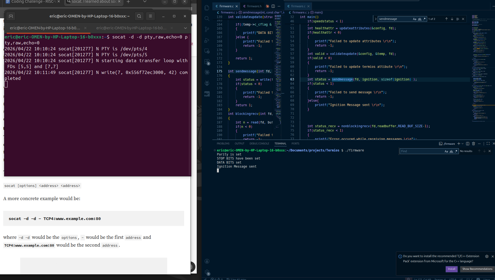
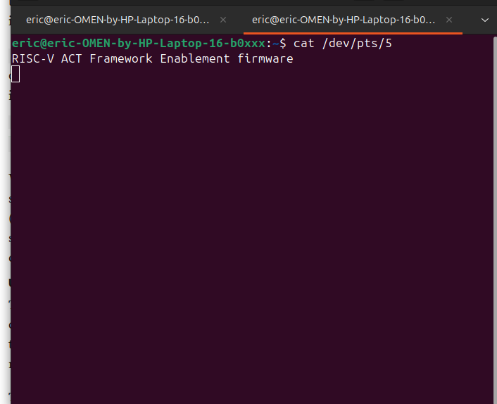
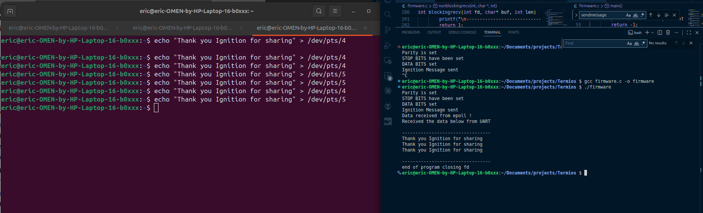

# TELEMETRY DATA INTERFACE 

The repo contains firmware for sending data over UART across the linux ecosystem. 
The path for the TTY device is defined as device in **firmware.c**. Edit the string to point the program to the right device. 

# Purpose 

The repo is meant to send across TTY devices in a linux ecosystem and will be used for RISCV ACT Framework Enablement. 

# Running 

The code has been compiled using gcc version 13.3.0 in Ubuntu 6.17.0. 

To run the code. 
- Clone the repo 
    ```sh 
    git clone https://github.com/eric-14/RISC-V-Support-for-ACT-Framework-development.git
    
    ``` 
- Navigate to the Termios folder and compile the firmware. 
    ```sh
    gcc firmware.c -o firmware
    
    ```

- Finally run the firmware.
    ```sh
    ./firmware 
    
    ```

# Common Errors 

+ **Failed to open port** - The file descriptor points to the wrong device. Confirm the path of the TTY device. The default path is 

        ```sh
         /dev/pts/4

        ```


# Testing 

Testing has been done using **socat**. A Linux tool for testing networking devices. 
In this instance we use socat to simulate TTY devices. 

## Running SOCAT 

+ Install socat in your system using. 

        ```sh
        sudo apt update; 
        sudo apt install socat

        ```
+ After installing socat the next step is to set it up to simulate virtual TTY devices. Run the command below. 
        ```sh
        socat -d -d pty,raw,echo=0 pty,raw,echo=0
        ```

+ The result should like the example below 

            ```sh
                2026/04/22 11:35:08 socat[381065] N PTY is /dev/pts/4
                2026/04/22 11:35:08 socat[381065] N PTY is /dev/pts/5
                2026/04/22 11:35:08 socat[381065] N starting data transfer loop with FDs [5,5] and [7,7]
            ```
+ You have now successfully set up a TTY channel where you can send bytes from **/dev/pts/4** and receive it at **/dev/pts/5** and vice versa.

+ Once you configure the TTY device the firmware will automatically send the **ignition** message to **/dev/pts/4** and running the following message will show the ignition message. 
                ```sh
                cat /dev/pts/5
                
                ```

+ Finally to send bytes to the firmware, run the following command. 
        ```sh
        echo "Thank you Ignition for sharing" > /dev/pts/4 
        
        ```


# Results of Testing 
**Image shows firmware sending message over TTY channel**





**Image of firmware receiving message sent over TTY channel** 
